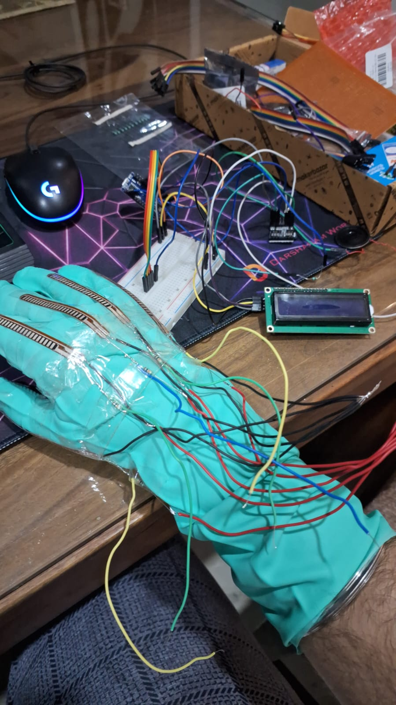

# 🧤 Sign Language Interpreter Glove (Text & Audio Output)

<<<<<<< 
A wearable Arduino-based glove that detects hand gestures using flex sensors and translates sign language into **spoken audio** and **text display** in both **English and Hindi**. Built using low-cost, open-source components, this project demonstrates how assistive technologies can improve accessibility and communication for the speech- and hearing-impaired.
=======
📦 Components Used
Component Quantity Description
Arduino Nano (ATMega328p) 1 Main microcontroller
Flex Sensors 5 One for each finger
16x2 LCD (I2C Interface) 1 For displaying detected words
DFPlayer Mini + SD Card 1 For playing audio output
9V Battery 1 Power supply
Jumper Wires, Resistors, Gloves As needed For connections and wearable setup
>>>>>>> e69bff1 (made folder structure changes)

---

<<<<<<< 
## 📦 Components Used

| Component                  | Quantity | Description                            |
|---------------------------|----------|----------------------------------------|
| Arduino Nano (ATMega328p) | 1        | Main microcontroller                   |
| Flex Sensors              | 5        | One for each finger                    |
| 16x2 LCD (I2C Interface)  | 1        | For displaying detected words          |
| DFPlayer Mini + SD Card   | 1        | For playing audio output               |
| 9V Battery                | 1        | Power supply                           |
| Jumper Wires, Resistors, Gloves | As needed | For connections and wearable setup |
=======
📂 Download: demo_video.mp4

---

## 🎬 Demo

📺 **Watch Demo Video**  
▶️ [`project_demonstration.mp4`](video/project_demonstration.mp4)

📷 **Hardware Setup**  

---

## 💡 Working Principle

1. Each flex sensor outputs analog values as fingers bend.
2. The Arduino reads these values and compares them against defined thresholds.
3. Based on gesture combinations, a word is identified from a predefined set.
4. On successful match:
   - The corresponding word is shown on the **LCD**.
   - The associated **audio file** is played using **DFPlayer Mini**.
5. A specific gesture toggles between **English** and **Hindi** language modes.

---

## 🧠 Features

- 🔤 Recognizes **30+ predefined gestures**
- 🌐 Multi-language support: **English** & **Hindi**
- 🔊 Real-time **audio playback** using DFPlayer Mini
- 🖥️ Text output via **LCD**
- 🧠 Efficient memory management using **PROGMEM**
- ✍️ Simple gesture mapping logic with easy scalability

---

## 🔮 Scope and Future Enhancements

While the current implementation builds a strong foundation, future upgrades could include:

- **🔧 Advanced Microcontrollers**  
  Upgrade to ESP32/Raspberry Pi for better performance, wireless capabilities, and memory.

- **🧠 AI-Powered Gesture Recognition**  
  Integrate machine learning models to support:
  - Dynamic hand movements
  - Full sentence-level translation

- **📡 Wireless Communication**  
  Enable Bluetooth/Wi-Fi for mobile or PC connectivity.

- **🌍 Multilingual Expansion**  
  Support additional regional or global languages for broader accessibility.

---

## 📁 File Structure

<<<<<<< HEAD
📁 Sign Language Interpreter Glove/
├── 📂 image/
│ └── project_image.jpg
├── 📂 video/
│ └── project_demonstration.mp4
├── 📄 README.md
├── 📄 Project synopsis.PDF
└── 📄 SignLanguageGlove.ino

---

## 📜 License

This project is licensed under the **MIT License**.  
Feel free to use, modify, and share it for educational, assistive tech, or research purposes.

---

## 🤝 Contributing

Suggestions, improvements, or bug fixes are welcome!  
=======
📁 File Structure
bash
Copy
Edit
├── Arduino_code.ino # Complete source code
├── synopsis.pdf # Project overview with circuit diagrams
├── video/
│ └── demo_video.mp4 # Project demo video
├── images/
│ └── glove.jpg # Image of glove hardware
📜 License
This project is licensed under the MIT License.
Feel free to use, modify, and share it for educational, assistive tech, or research purposes.

🤝 Contributing
Suggestions, improvements, or bug fixes are welcome!
>>>>>>> e69bff1 (made folder structure changes)
Feel free to open issues or submit pull requests.
